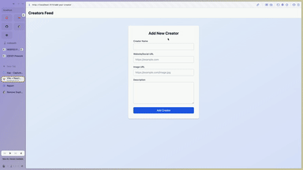

# WEB103 Prework - *Creators Feed*

Submitted by: **Han Luu**

About this web app: **This web app will display all your favorite content creators. You first add your creators, later on can update any infomation as needed or delete it.**

Time spent: **5** hours

## Required Features

The following **required** functionality is completed:

<!-- 👉🏿👉🏿👉🏿 Make sure to check off completed functionality below -->
- [x] **A logical component structure in React is used to create the frontend of the app**
- [x] **At least five content creators are displayed on the homepage of the app**
- [x] **Each content creator item includes their name, a link to their channel/page, and a short description of their content**
- [x] **API calls use the async/await design pattern via Axios or fetch()**
- [x] **Clicking on a content creator item takes the user to their details page, which includes their name, url, and description**
- [x] **Each content creator has their own unique URL**
- [x] **The user can edit a content creator to change their name, url, or description**
- [x] **The user can delete a content creator**
- [x] **The user can add a new content creator by entering a name, url, or description and then it is displayed on the homepage**

The following **optional** features are implemented:

- [X] I use TailwindCSS to make the code cleaner
- [X] The content creator items are displayed in a creative format, like cards instead of a list
- [X] An image of each content creator is shown on their content creator card

The following **additional** features are implemented:

* [ ] List anything else that you added to improve the site's functionality!

## Video Walkthrough

Here's a walkthrough of implemented required features:

👉🏿

GIF created with Chrome capture
